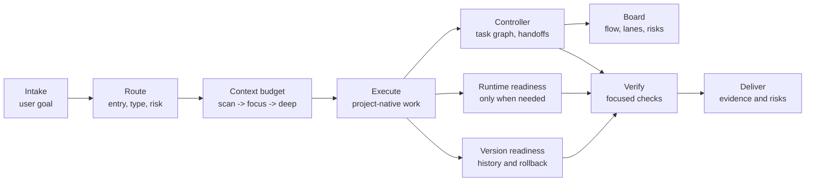

# omyKit

[](VERSION)
[](LICENSE)
[](skills)
[](docs/README.md)
[](https://github.com/GnosiST/omyKit/actions/workflows/validate.yml)

**A lightweight Codex workflow kit for context-aware project routing, low-waste execution, verification gates, runtime readiness, and rollback-aware delivery.**

omyKit packages a small, procedural operating layer for Codex. It helps agents decide when to initialize project rules, retrofit an existing repository, execute a scoped change, prepare local runtime dependencies, check version readiness, and run delivery gates before handoff.

The kit is designed to stay out of the way after routing. Once a task is classified, normal execution continues without re-running the workflow for every file read, edit, command, or intermediate check.

Languages: [English](README.md) | [简体中文](README.zh-CN.md)

## Why omyKit

- **Clear routing:** classify work by entry type, project type, risk, and artifact.
- **Low context waste:** load context progressively with `scan -> focus -> deep`.
- **Compression-aware budgeting:** narrow and summarize first, then use optional local compression only when large retrievable content still matters.
- **Durable task graph:** use a local C-lite controller and static board for long, resumable, multi-node work.
- **Delivery evidence:** finish with targeted checks instead of unverified completion claims.
- **Runtime readiness:** prepare middleware only when tests or app checks need it.
- **Version awareness:** surface branch, changelog, rollback, history, and customization gaps.
- **Language-aware output:** match visible plans, questions, reasoning summaries, and handoff to the user's prompt language.
- **Source-aware selection:** mark each registry entry as a core item, installed skill, tracked upstream reference, platform tool, OpenAI bundled tool, or repo-local mechanism before using it.
- **Conservative skill admission:** keep community PM, taste, catalog, and meta-UX skills out of default routing unless the user explicitly requests them.
- **Evidence-based evolution:** promote only reusable workflow lessons into omyKit, while keeping target-project facts isolated.
- **Upstream reference watch:** periodically check referenced external sources for changes, then review useful workflow lessons before adopting anything.

## Workflow At A Glance



## Quick Start

### Install From Codex

For first-time install, you do not have `$omykit` yet. Ask Codex in plain language:

```text
Install omyKit from https://github.com/GnosiST/omyKit
```

Codex can clone the repository, run the installer, and report the install manifest. After installation, open a fresh Codex thread so the skill list refreshes.

Manual fallback:

```bash
git clone https://github.com/GnosiST/omyKit.git
cd omyKit
./scripts/install-global.sh
```

### Use From Codex

Open a fresh Codex thread and type one of these in Codex chat:

```text
$omykit 初始化项目
$omykit 改造旧项目
$omykit 开始一个需求
$omykit 生成看板并打开
$omykit 查看工作流状态
$omykit 交付检查
$omykit 更新自己
```

Codex should run any required controller or install commands internally and return the result, paths, and residual risks. The leading `$` is part of the skill trigger, not a shell prompt.

If your Codex client supports prompt files, this is also a Codex chat input:

```text
/prompts:omykit 初始化项目
```

Do not assume `/omykit` is available unless your local Codex client explicitly maps custom prompt files to that command form.

For tracked controller workflows, prefer the Codex chat form:

```text
$omykit 生成看板并打开
```

Codex will run the controller internally and return the generated paths. Manual fallback from a project shell:

```bash
node scripts/omykit-workflow.mjs board --open --lang zh-CN
```

This command writes `.omykit/workflows/<workflow-id>/board.json` and `board.html`. Use `--lang zh-CN` for Simplified Chinese labels. It is a local static view, not a realtime service.

## What It Includes

| Path | Purpose |
| --- | --- |
| `skills/` | Codex skills installed into `${CODEX_HOME:-$HOME/.codex}/skills/`. |
| `prompts/` | Optional prompt alias for starting omyKit from clients that support prompt files. |
| `docs/workflow/` | Workflow notes for setup, routing, controller, context budgeting, runtime readiness, versioning, tool selection, and delivery gates. |
| `schemas/` | JSON schemas for controller graphs, node cards, state, and handoffs. |
| `scripts/` | Validation, workflow controller, global installation, install-from-ref, and rollback helpers. |
| `upstream-sources.json` | Tracked external reference baselines plus source-integrity snapshots for official workflow, spec, local-skill, platform-tool, design, motion, ecosystem, and context-compression sources. |
| `AGENTS.md` | Maintenance rules for agents working in this repository. |

## Skill Layer

| Skill | Role |
| --- | --- |
| `omykit` | Entry point for initialization, retrofit, change work, and delivery checks. |
| `codex-project-router` | Classifies entry type, project type, workflow mode, and tool path. |
| `codex-context-budget` | Keeps context loading progressive and compression-aware: `scan -> focus -> deep`, with original retrieval for exact evidence. |
| `codex-project-init` | Creates the minimum Codex workflow layer for a new project. |
| `codex-project-retrofit` | Adds workflow structure to an existing project without disrupting it. |
| `codex-change-workflow` | Runs scoped feature, fix, refactor, or artifact work through focused verification. |
| `codex-runtime-readiness` | Prepares local services such as databases, caches, object storage, queues, browsers, or emulators when verification needs them. |
| `codex-version-readiness` | Checks target-project branch, release, rollback, history lookup, and customization readiness. |
| `codex-delivery-gate` | Checks artifact-specific evidence before handoff, export, commit, PR, or release. |
| `codex-workflow-evolution` | Promotes repeated workflow lessons into omyKit only when they pass evidence and abstraction tests. |

See [Skill coordination](docs/workflow/skill-coordination.md) for what each integrated skill owns, when it hands off, and why the skills do not conflict.

## Controller Layer

For long or Strict work, omyKit can persist a task graph under `.omykit/workflows/<workflow-id>/` and use `scripts/omykit-workflow.mjs` to validate handoffs, show ready nodes, record blockers, generate a static collaboration board, and support compact recovery.

The controller is local and deterministic. It does not call models, edit code by itself, replace Codex, or make Lite tasks heavy by default. Global install copies it to `${CODEX_HOME:-$HOME/.codex}/omykit/scripts/omykit-workflow.mjs` with schemas under `${CODEX_HOME:-$HOME/.codex}/omykit/schemas/`.

The board command produces `board.json` for machine-readable projection and `board.html` for browser review. It shows project snapshot, Git branch/commit/status, active changes, key files, recent commits, status columns, dependency flow, reject edges, worker lanes, node handoff summaries, verification evidence, blockers, decisions, retries, and recent ledger events without introducing a server or database.

## Workflow Model

```text
intake -> route -> context budget -> spec/brief -> runtime readiness -> execute -> verify -> deliver -> learn
```

Operational rules:

- Route once at task intake, when scope or risk changes, or before delivery.
- Use workflow skills at task boundaries and meaningful phase changes, not for every individual action.
- Enable the controller only for tracked multi-node, resumable, compact-prone, rejected, parallel, or Strict work.
- Start with `scan`, move to `focus` for implementation, and use `deep` only when risk or blockage justifies it.
- For large outputs, avoid and narrow first; summarize next; use optional compression only when the source is trusted, retrievable, and still useful.
- Prefer project-native commands and existing repository conventions before adding new tools.
- Check versioning readiness for durable changes: branch state, history lookup, rollback path, release notes, and customization boundary.
- Treat generated project rules as local project assets, not global defaults.
- Ask for user input only when a safe assumption is not possible; when asking, allow custom answers instead of limiting the user to fixed options.

## Documentation

- [Documentation index](docs/README.md)
- [中文文档索引](docs/README.zh-CN.md)
- [Setup guide](docs/workflow/setup.md)
- [Workflow overview](docs/workflow/codex-workflow-kit.md)
- [Skill coordination](docs/workflow/skill-coordination.md)
- [Workflow controller](docs/workflow/controller.md)
- [Task graph](docs/workflow/task-graph.md)
- [Handoff protocol](docs/workflow/handoff-protocol.md)
- [Language policy](docs/workflow/language-policy.md)
- [Versioning readiness](docs/workflow/versioning.md)
- [Tool registry](docs/workflow/tool-registry.md)
- [Upstream reference watch](docs/workflow/upstream-watch.md)
- [Workflow evolution](docs/workflow/evolution.md)
- [Delivery gates](docs/workflow/delivery-gates.md)

## Validation

```bash
./scripts/validate-skills.sh
```

The validator uses Codex's `skill-creator` validation script and also enforces omyKit's required `Language` section for user-language matching and private chain-of-thought boundaries. If the selected Python runtime does not include `PyYAML`, the script prints disposable virtual environment commands. You can also provide a Python executable explicitly:

```bash
PYTHON=/path/to/venv/bin/python ./scripts/validate-skills.sh
```

Recommended pre-handoff checks:

```bash
./scripts/validate-skills.sh
node scripts/test-omykit-workflow.mjs
node ./scripts/validate-docs.mjs
node ./scripts/check-upstream-refs.mjs
git diff --check
```

## Version And Rollback Readiness

omyKit includes `codex-version-readiness` for target projects. Use it when initializing or retrofitting a repository, preparing a release, handling migrations, changing dependencies, or making any change where rollback or historical lookup matters.

It checks whether the target project has an appropriate version source, changelog or release notes, git branch state, tags/releases, rollback plan, and customization path. It reports gaps instead of forcing heavyweight release machinery onto small or temporary work.

For this repository itself:

```bash
./scripts/install-global.sh
./scripts/install-ref.sh main
./scripts/install-ref.sh <release-tag-or-commit-sha>
./scripts/rollback-global.sh latest
```

## Maintenance

After changing skill files:

1. Run `./scripts/validate-skills.sh`.
2. Run `node scripts/test-omykit-workflow.mjs` when controller scripts or schemas changed.
3. Run `node ./scripts/validate-docs.mjs`.
4. Run `node ./scripts/check-upstream-refs.mjs` before releases or when external references may affect workflow rules.
5. Run `./scripts/install-global.sh` to update the global Codex skill copy and controller files.
6. Review `${CODEX_HOME:-$HOME/.codex}/omykit/install-manifest`; release/handoff installs should point to the final commit with `git_dirty=false`.
7. Review `git diff --check`.
8. Commit and push only after the local and global copies are verified.

## Copyright And Third-Party References

This repository is intended to contain original workflow instructions, scripts, and documentation for omyKit. It does not intentionally bundle third-party proprietary assets, private documentation, or copied product manuals.

Names such as Codex, GitHub, Docker, Canva, Remotion, and other referenced tools are used descriptively to identify integrations or workflow contexts. Those names may be trademarks of their respective owners. This project is not endorsed by, sponsored by, or affiliated with those owners unless explicitly stated.

When adding new content, keep examples, prose, and templates original or clearly licensed for reuse. Do not copy third-party documentation, brand assets, screenshots, icons, or proprietary workflow text into this repository without confirming the applicable license and attribution requirements. Keep external projects as links, source-integrity snapshots, and scoped reference notes unless their license and attribution requirements allow vendoring.

## License

MIT. See [LICENSE](LICENSE).
