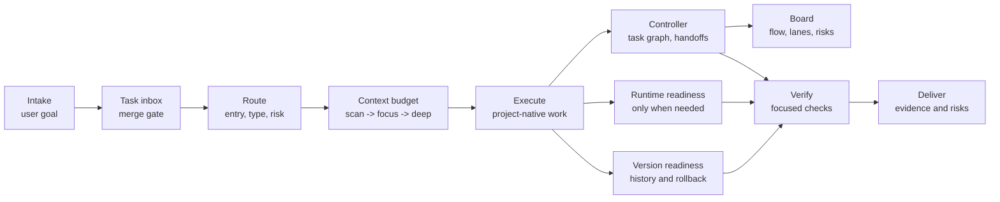

# omyKit

[](VERSION)
[](LICENSE)
[](skills)
[](docs/README.md)
[](https://github.com/GnosiST/omyKit/actions/workflows/validate.yml)

**A lightweight Codex workflow kit for context-aware project routing, low-waste execution, verification gates, runtime readiness, and rollback-aware delivery.**

omyKit packages a small, procedural operating layer for Codex. It helps agents decide when to initialize project rules, retrofit an existing repository, execute a scoped change, prepare local runtime dependencies, check version readiness, and run delivery gates before handoff.

The kit is designed to stay out of the way after routing. Once a task is classified, normal execution continues without re-running the workflow for every file read, edit, command, or intermediate check.

Languages: [English](README.md) | [简体中文](README.zh-CN.md)

## Why omyKit

- **Clear routing:** classify work by entry type, project type, risk, and artifact.
- **Intake decision gate:** show the chosen route and ask 1-3 custom-answer questions only when ambiguity would change the work.
- **Pre-execution choice gate:** present viable execution options, recommend one, and capture confirmation before implementation or worker dispatch.
- **Low context waste:** load context progressively with `scan -> focus -> deep`.
- **Compression-aware budgeting:** narrow and summarize first, then use optional local compression only when large retrievable content still matters.
- **Template-driven task graph:** use reusable workflow templates plus a local C-lite controller and static board for long, resumable, multi-node work.
- **Task inbox and merge gate:** record repeated task briefs, merge same-family work into active workflows, link follow-ups, or split unrelated requests into new workflows.
- **Scorecard audit:** check real handoffs, intake decisions, delivery evolution reviews, verification evidence, language consistency, skill usage, usage records, model recommendations, and actual model records before trusting completion claims.
- **Skill traceability:** show which skills shaped each node or worker when they were actually used.
- **Model traceability:** recommend a right-sized model per node, pass worker model overrides in Codex Desktop, and show actual recorded models when execution exposes them.
- **Automatic orchestration:** keep the main Codex thread as an orchestrator-observer while the controller recommends whether ready work should run in the main thread, a subagent, a background thread, or a worktree.
- **Delivery evidence:** finish with targeted checks instead of unverified completion claims.
- **Runtime readiness:** prepare middleware only when tests or app checks need it.
- **Version awareness:** surface branch, changelog, rollback, history, and customization gaps.
- **Language-aware output:** match visible plans, questions, reasoning summaries, and handoff to the user's prompt language.
- **Source-aware selection:** mark each registry entry as a core item, installed skill, tracked upstream reference, platform tool, OpenAI bundled tool, or repo-local mechanism before using it.
- **Conservative skill admission:** keep community PM, taste, catalog, and meta-UX skills out of default routing unless the user explicitly requests them.
- **Evidence-based evolution:** delivery handoffs record reusable workflow candidates, scorecards verify the review happened, and only abstracted lessons are promoted into omyKit.
- **Upstream reference watch:** periodically check referenced external sources for changes, then review useful workflow lessons before adopting anything.

## Workflow At A Glance



## Quick Start

### Install From Codex

For first-time install, you do not have `$omykit` yet. Ask Codex in plain language:

```text
Install omyKit from https://github.com/GnosiST/omyKit
```

Codex can clone the repository, run the installer, and report the install manifest. The installer copies real files and does not install Codex skills as symlinks. After installation, open a fresh Codex thread so the skill list refreshes.

Manual fallback:

```bash
git clone https://github.com/GnosiST/omyKit.git
cd omyKit
./scripts/install-global.sh
```

### Use From Codex

Open a fresh Codex thread and type one of these in Codex chat:

```text
$omykit help
$omykit 初始化项目
$omykit 改造旧项目
$omykit 开始一个需求
$omykit 开始执行：<long task>
$omykit 只创建工作流：<task>
$omykit 继续工作流
$omykit 解除阻塞
$omykit 生成看板并打开
$omykit 查看工作流状态
$omykit 升级旧工作流
$omykit 诊断工作流健康
$omykit 清理旧工作流残留
$omykit 交付检查
$omykit 更新自己
```

Codex should run any required controller or install commands internally and return the result, paths, and residual risks. The leading `$` is part of the skill trigger, not a shell prompt.

Use `$omykit help` or `$omykit 帮助` when you want the command list and usage guidance without opening the docs.

If your Codex client supports prompt files, this is also a Codex chat input:

```text
/prompts:omykit 初始化项目
```

Do not assume `/omykit` is available unless your local Codex client explicitly maps custom prompt files to that command form.

For tracked controller workflows, prefer the Codex chat form:

```text
$omykit 开始执行：测试 MVP1 角色权限
$omykit 继续执行
$omykit 查看工作流列表
$omykit 下一步
$omykit 生成看板并打开
```

`开始执行` means Codex should create or resume the workflow, run the automatic orchestration plan, start or dispatch ready work internally, write handoffs, and continue until delivery passes or a real blocker needs the user. Use `只创建工作流` only when you want the workflow skeleton and manual continuation command. Codex will run the controller internally and return the generated paths. Manual fallback from a project shell:

```bash
node scripts/omykit-workflow.mjs workflows
node scripts/omykit-workflow.mjs workflows use <workflow-id>
node scripts/omykit-workflow.mjs resume
node scripts/omykit-workflow.mjs orchestrate --json
node scripts/omykit-workflow.mjs upgrade --all
node scripts/omykit-workflow.mjs doctor --lang zh-CN
node scripts/omykit-workflow.mjs cleanup --dry-run --lang zh-CN
node scripts/omykit-workflow.mjs board --open --lang zh-CN
```

The controller still exposes lower-level primitives such as `tasks`, `dispatch-plan`, `context-pack`, `assign`, and `record-run` for Codex internals, CI, or troubleshooting. They are not normal user choices. Task-specific Codex requests first enter the task inbox so the merge gate can decide whether to merge into the active workflow, link as a follow-up, or create a new workflow. `doctor` writes `.omykit/health/health-report.json` and inspects retrofit completeness, active workflow pointers, task inbox parseability, legacy artifact gaps, stale boards, command recovery signals, cleanup candidates, and next recommendations. `doctor --fix` only applies safe compatibility repairs; it does not fabricate handoffs, usage, model, skill, or verification evidence. `cleanup` defaults to dry-run, and `cleanup --apply` archives safe candidates under `.omykit/archive/` instead of deleting them. The board command writes `.omykit/workflows/<workflow-id>/board.json` and `board.html`. New tracked workflows can use `--template auto` to choose among `change.standard`, `bugfix.standard`, `frontend-ui.strict`, and `mission.orchestration`; explicit template choices override auto. The board language follows the workflow language by default and can be overridden with `--lang zh-CN`. It also shows the task inbox, workstreams, conflict-arbiter signals, recorded skill usage, execution options and confirmation, recommended models, actual model records, delivery knowledge sync review, the Agent Roster, handoff packets, compact context packets, and command-run recovery records per node and per worker when handoffs or assignments provide them. It is a local static view, not a realtime service.

## What It Includes

| Path | Purpose |
| --- | --- |
| `skills/` | Codex skills installed into `${CODEX_HOME:-$HOME/.codex}/skills/`. |
| `prompts/` | Optional prompt alias for starting omyKit from clients that support prompt files. |
| `docs/workflow/` | Workflow notes for setup, routing, controller, context budgeting, runtime readiness, versioning, tool selection, and delivery gates. |
| `schemas/` | JSON schemas for controller graphs, node cards, state, assignments, and handoffs. |
| `scripts/` | Validation, workflow controller, global installation, install-from-ref, and rollback helpers. |
| `workflow-templates/` | Layered YAML workflow templates, agent/model/runtime/safety profiles, and scorecards used by the controller. |
| `upstream-sources.json` | Tracked external reference baselines plus source-integrity snapshots for official workflow, spec, local-skill, platform-tool, design, motion, ecosystem, and context-compression sources. |
| `AGENTS.md` | Maintenance rules for agents working in this repository. |

## Skill Layer

| Skill | Role |
| --- | --- |
| `omykit` | Entry point for initialization, retrofit, change work, and delivery checks. |
| `codex-project-router` | Classifies entry type, project type, workflow mode, and tool path. |
| `codex-context-budget` | Keeps context loading progressive and compression-aware: `scan -> focus -> deep`, with original retrieval for exact evidence. |
| `codex-project-init` | Creates the minimum Codex workflow layer for a new project. |
| `codex-project-retrofit` | Adds workflow structure to an existing project without disrupting it. |
| `codex-change-workflow` | Runs scoped feature, fix, refactor, or artifact work through focused verification. |
| `codex-runtime-readiness` | Prepares local services such as databases, caches, object storage, queues, browsers, or emulators when verification needs them. |
| `codex-version-readiness` | Checks target-project branch, release, rollback, history lookup, and customization readiness. |
| `codex-delivery-gate` | Checks artifact-specific evidence before handoff, export, commit, PR, or release. |
| `codex-workflow-evolution` | Promotes repeated workflow lessons into omyKit only when they pass evidence and abstraction tests. |

See [Skill coordination](docs/workflow/skill-coordination.md) for what each integrated skill owns, when it hands off, and why the skills do not conflict.

## Controller Layer

For long or Strict work, omyKit can persist a task graph under `.omykit/workflows/<workflow-id>/` and use `scripts/omykit-workflow.mjs` to record task briefs, run the merge gate, validate handoffs, show ready nodes, record blockers, generate node context packs, record long-running command recovery metadata, generate a static collaboration board, and support compact recovery.

The controller is local and deterministic. It does not call models, spawn agents, edit code by itself, replace Codex, or make Lite tasks heavy by default. Global install copies it to `${CODEX_HOME:-$HOME/.codex}/omykit/scripts/omykit-workflow.mjs` with schemas under `${CODEX_HOME:-$HOME/.codex}/omykit/schemas/`.

The controller is template-driven. Built-in YAML templates define graph topology, agent roles, model profile, runtime profile, safety limits, and scorecards separately, so the same task class can reuse a stable workflow while each issue supplies different inputs and evidence. `init --template auto` chooses among `change.standard`, `bugfix.standard`, `frontend-ui.strict`, and `mission.orchestration`; explicit template requests still override auto. Use `templates list`, `templates show <id>`, and `templates validate` to inspect or validate the installed templates.

The board command produces `board.json` for machine-readable projection and `board.html` for browser review. It shows the selected template, scorecard results, task inbox, merge-gate decisions, workstreams, conflict-arbiter signals, intake decisions, workflow evolution candidates, delivery knowledge sync review, a clickable task tracker with actual node work items, changed-file summaries, recorded skill usage, verification results, evidence availability, downstream handoff context, generated handoff packets, command-run recovery records, agent activity, recommended model tiers, recommended concrete models, actual model records, usage-observation status, token and context coverage, per-node timing, ETA estimates, project snapshot, dependency/reject flow, worker lanes, blockers, decisions, retries, events, and generated improvement actions without introducing a server or database. Token, context, skill-usage, and actual-model totals only aggregate recorded evidence; unavailable runtime metrics are shown separately from missing records and are never guessed.

## Workflow Model

```text
intake -> task inbox/merge gate -> route -> context budget -> spec/brief -> runtime readiness -> execute -> verify -> deliver -> learn
```

Operational rules:

- Route once at task intake, when scope or risk changes, or before delivery.
- Record task-specific briefs in the task inbox first; merge same-family work, link follow-ups, and split unrelated requests before worker dispatch.
- At intake, state the goal, route, execution shape or controller template, and material assumptions before implementation.
- Before implementation or worker dispatch, present execution options, recommend one, explain tradeoffs, and capture user confirmation or explicit auto-authorization.
- Use workflow skills at task boundaries and meaningful phase changes, not for every individual action.
- Enable the controller only for tracked multi-node, resumable, compact-prone, rejected, parallel, or Strict work.
- Creating a tracked workflow is not task completion; for long work, continue `resume/orchestrate -> internal start or dispatch -> work -> handoff -> complete/reject/block/unblock` until delivery passes or a real blocker is recorded.
- For multi-agent work, let the orchestration plan choose main-thread, subagent, background-thread, or worktree execution from task fit; keep the main thread on its current model as orchestrator-observer, and pass the node's recommended model override to Codex workers.
- Use `upgrade --all` when historical `.omykit/workflows/*` artifacts need current controller metadata, command-surface policy, node cards, and regenerated board projections; never fabricate missing handoff, token, skill, model, or verification evidence during upgrade.
- For tracked work, pick the nearest workflow template first; customize by adding or editing template/profile YAML instead of hard-coding one-off controller behavior.
- Use `mission.orchestration` for broad demands that need requirement insight, task decomposition, multiple workflow/workstream routing, monitored execution, integration gates, and delivery learning.
- Choose the lowest sufficient model tier for each node; use the configured model profile for recommendations, then record actual provider/model only when execution exposes it.
- When the runtime does not expose exact token counts or actual worker models, record `usage_observation` with `unavailable` reason instead of fabricating metrics.
- Treat drift as a workflow event: non-blocking drift goes into handoff notes and downstream risks; acceptance, safety, target-project, destructive-action, or template drift must block or reject the affected node with evidence.
- When multiple same-lane specialist skills could apply, record `skill_decisions`: why one was selected, which alternatives were skipped, which skill to use for dissatisfied-user rework, and the actual feedback outcome.
- For tracked delivery, record `evolution_candidates`; use an empty array when the work was reviewed and no reusable workflow lesson should be promoted.
- Also record delivery `knowledge_sync`: `completed` when README/docs/AGENTS or memory were reconciled, `not_needed` when no durable knowledge changed, or `deferred` with a reason.
- Start with `scan`, move to `focus` for implementation, and use `deep` only when risk or blockage justifies it.
- For large outputs, avoid and narrow first; summarize next; use optional compression only when the source is trusted, retrievable, and still useful.
- Prefer project-native commands and existing repository conventions before adding new tools.
- For platform-specific projects, discover official CLIs or automation APIs from project evidence and current official docs, then record them in project-local guidance when useful.
- Prefer official, first-party, dedicated, or project-native tools before Computer Use; use Computer Use only as the final fallback for local GUI work without a better supported path.
- Check versioning readiness for durable changes: branch state, history lookup, rollback path, release notes, and customization boundary.
- Treat generated project rules as local project assets, not global defaults.
- Ask 1-3 questions only when a safe assumption is not possible and the answer would change the deliverable, target project, risk, runtime, workflow template, or controller choice; when asking, allow custom answers instead of limiting the user to fixed options.

## Documentation

- [Documentation index](docs/README.md)
- [中文文档索引](docs/README.zh-CN.md)
- [Setup guide](docs/workflow/setup.md)
- [Workflow overview](docs/workflow/codex-workflow-kit.md)
- [Skill coordination](docs/workflow/skill-coordination.md)
- [Workflow controller](docs/workflow/controller.md)
- [Workflow templates](docs/workflow/workflow-templates.md)
- [Task graph](docs/workflow/task-graph.md)
- [Handoff protocol](docs/workflow/handoff-protocol.md)
- [Multi-agent coordination](docs/workflow/multi-agent-coordination.md)
- [Language policy](docs/workflow/language-policy.md)
- [Versioning readiness](docs/workflow/versioning.md)
- [Tool registry](docs/workflow/tool-registry.md)
- [Upstream reference watch](docs/workflow/upstream-watch.md)
- [Workflow evolution](docs/workflow/evolution.md)
- [Delivery gates](docs/workflow/delivery-gates.md)

## Validation

```bash
./scripts/validate-skills.sh
```

The validator uses Codex's `skill-creator` validation script and also enforces omyKit's required `Language` section for user-language matching and private chain-of-thought boundaries. If the selected Python runtime does not include `PyYAML`, the script prints disposable virtual environment commands. You can also provide a Python executable explicitly:

```bash
PYTHON=/path/to/venv/bin/python ./scripts/validate-skills.sh
```

Recommended pre-handoff checks:

```bash
./scripts/validate-skills.sh
node scripts/omykit-workflow.mjs templates validate
node scripts/test-omykit-workflow.mjs
node ./scripts/validate-docs.mjs
node ./scripts/check-upstream-refs.mjs
git diff --check
```

## Version And Rollback Readiness

omyKit includes `codex-version-readiness` for target projects. Use it when initializing or retrofitting a repository, preparing a release, handling migrations, changing dependencies, or making any change where rollback or historical lookup matters.

It checks whether the target project has an appropriate version source, changelog or release notes, git branch state, tags/releases, rollback plan, and customization path. It reports gaps instead of forcing heavyweight release machinery onto small or temporary work.

For this repository itself:

```bash
./scripts/install-global.sh
./scripts/install-ref.sh main
./scripts/install-ref.sh <release-tag-or-commit-sha>
./scripts/rollback-global.sh latest
```

## Maintenance

After changing skill files:

1. Run `./scripts/validate-skills.sh`.
2. Run `node scripts/test-omykit-workflow.mjs` when controller scripts or schemas changed.
3. Run `node ./scripts/validate-docs.mjs`.
4. Run `node ./scripts/check-upstream-refs.mjs` before releases or when external references may affect workflow rules.
5. Run `./scripts/install-global.sh` to update the global Codex skill copy and controller files; installed outputs must be real files/directories, not symlinks.
6. Review `${CODEX_HOME:-$HOME/.codex}/omykit/install-manifest`; release/handoff installs should point to the final commit with `git_dirty=false`.
7. Review `git diff --check`.
8. Commit and push only after the local and global copies are verified.

## Copyright And Third-Party References

This repository is intended to contain original workflow instructions, scripts, and documentation for omyKit. It does not intentionally bundle third-party proprietary assets, private documentation, or copied product manuals.

Names such as Codex, GitHub, Docker, Canva, Remotion, and other referenced tools are used descriptively to identify integrations or workflow contexts. Those names may be trademarks of their respective owners. This project is not endorsed by, sponsored by, or affiliated with those owners unless explicitly stated.

When adding new content, keep examples, prose, and templates original or clearly licensed for reuse. Do not copy third-party documentation, brand assets, screenshots, icons, or proprietary workflow text into this repository without confirming the applicable license and attribution requirements. Keep external projects as links, source-integrity snapshots, and scoped reference notes unless their license and attribution requirements allow vendoring.

## License

MIT. See [LICENSE](LICENSE).
