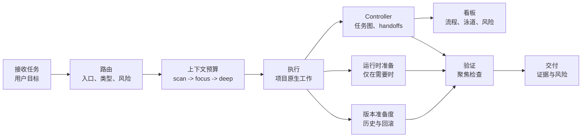

# omyKit

[](VERSION)
[](LICENSE)
[](skills)
[](docs/README.zh-CN.md)
[](https://github.com/GnosiST/omyKit/actions/workflows/validate.yml)

**omyKit 是一套轻量的 Codex 工作流套件，用于按上下文路由项目任务、降低上下文消耗、补齐验证门禁、准备运行时依赖，并让交付具备版本与回滚意识。**

它把一组全局 Codex skills、prompt 别名、工作流文档和安装/回滚脚本组织成一个小而清晰的操作层。Codex 可以用它判断什么时候初始化项目规则、改造旧项目、执行具体需求、准备本地服务、检查版本管理状态，以及在交付前运行对应门禁。

omyKit 不希望接管每一步操作。任务被正确路由后，Codex 应该继续正常执行，只有在范围、风险、阶段或交付状态变化时才重新进入工作流。

语言：[English](README.md) | [简体中文](README.zh-CN.md)

## 为什么需要 omyKit

- **清晰路由：**按入口类型、项目类型、风险模式和交付物类型选择工作流。
- **入口决策闸门：**先展示所选路由，只有歧义会改变工作结果时才问 1-3 个允许自定义答案的问题。
- **低上下文浪费：**用 `scan -> focus -> deep` 逐级加载上下文。
- **压缩感知预算：**先缩小范围和摘要，只有大型可取回内容仍然重要时，才使用可选本地压缩。
- **模板驱动任务图：**长任务、可续跑任务和多节点工作可复用 workflow 模板，并使用本地 C-lite controller 和静态看板。
- **Scorecard 验票：**先检查真实 handoff、入口决策、交付进化复盘、验证证据、语言一致性、skill 使用、用量记录、推荐模型和实际模型记录，再相信完成声明。
- **Skill 可追踪：**实际使用过 skill 时，看板能展示每个节点或 worker 用了什么。
- **模型可追踪：**按节点推荐合适档位和具体模型，并在运行环境暴露时展示实际使用模型。
- **自动编排：**主 Codex 对话保持 orchestrator-observer，由 controller 判断就绪工作应该在主线程、子智能体、后台线程还是 worktree 中执行。
- **交付证据：**用可复核的检查结果替代空泛的“已完成”。
- **运行时准备：**只有测试或应用检查需要中间件时才准备数据库、缓存、队列、对象存储等服务。
- **版本意识：**暴露分支、changelog、tag/release、回滚、历史追踪和定制化边界缺口。
- **语言感知输出：**可见计划、问题、推理摘要和 handoff 跟随用户提示词语言。
- **来源感知选择：**先标清每个注册表条目是核心项、本地已安装 skill、已跟踪上游参考、平台工具、OpenAI bundled 工具，还是仓库本地机制，再决定是否使用。
- **保守 skill 准入：**社区 PM、审美、目录和 meta-UX 类 skill 不进入默认路由，除非用户明确要求。
- **证据驱动进化：**delivery handoff 记录可复用 workflow 候选，scorecard 验证复盘是否发生，只有通过抽象测试的经验才提升进 omyKit。
- **上游参考监控：**定期检查被引用的外部来源是否变化，先审查可复用 workflow 经验，再决定是否吸收。

## 工作流一览



## 快速开始

### 在 Codex 中安装

首次安装时还没有 `$omykit`，所以直接用普通对话告诉 Codex：

```text
帮我安装 omyKit：https://github.com/GnosiST/omyKit
```

Codex 可以替你 clone 仓库、运行安装脚本，并返回 install manifest。安装脚本会复制真实文件，不使用 symlink 安装 Codex skills。安装完成后，打开新的 Codex 线程让 skill 列表刷新。

手动 fallback：

```bash
git clone https://github.com/GnosiST/omyKit.git
cd omyKit
./scripts/install-global.sh
```

### 在 Codex 中使用

打开新的 Codex 线程，然后在 Codex 对话里输入：

```text
$omykit help
$omykit 初始化项目
$omykit 改造旧项目
$omykit 开始一个需求
$omykit 开始执行：<长任务>
$omykit 只创建工作流：<任务>
$omykit 继续工作流
$omykit 解除阻塞
$omykit 生成看板并打开
$omykit 查看工作流状态
$omykit 升级旧工作流
$omykit 交付检查
$omykit 更新自己
```

Codex 应该在内部运行需要的 controller 或安装命令，并把结果、路径和剩余风险返回给你。开头的 `$` 是 skill 触发写法的一部分，不是 shell 提示符。

如果只是想看命令和用法，直接输入 `$omykit help` 或 `$omykit 帮助`，不需要再翻文档。

如果你的 Codex 客户端支持 prompt 文件，这也是 Codex 对话输入，不是终端命令：

```text
/prompts:omykit 初始化项目
```

不要默认假设 `/omykit` 可用，除非本地 Codex 客户端明确把自定义 prompt 映射成这种命令形式。

对于已启用 controller 的追踪型 workflow，优先使用 Codex 对话：

```text
$omykit 开始执行：测试 MVP1 角色权限
$omykit 继续执行
$omykit 查看工作流列表
$omykit 下一步
$omykit 生成看板并打开
```

`开始执行` 表示 Codex 应该创建或续跑 workflow、运行自动编排计划、内部启动或派发就绪工作、写 handoff，并持续推进到 delivery 通过或遇到真实阻塞。只有想先拿骨架和手动续跑命令时，才用 `只创建工作流`。Codex 会在内部运行 controller，并返回生成路径。项目终端中的手动 fallback：

```bash
node scripts/omykit-workflow.mjs workflows
node scripts/omykit-workflow.mjs workflows use <workflow-id>
node scripts/omykit-workflow.mjs resume
node scripts/omykit-workflow.mjs orchestrate --json
node scripts/omykit-workflow.mjs upgrade --all
node scripts/omykit-workflow.mjs board --open --lang zh-CN
```

controller 仍然保留 `dispatch-plan`、`context-pack`、`assign` 和 `record-run` 等低层原子命令，供 Codex 内部、CI 或排障使用；它们不是普通用户默认要选择的命令。`board` 命令会写入 `.omykit/workflows/<workflow-id>/board.json` 和 `board.html`。新的追踪型 workflow 可以选择 `change.standard`、`bugfix.standard`、`frontend-ui.strict` 等可复用模板；未指定时使用 `change.standard`。看板语言默认跟随 workflow 语言，也可以用 `--lang zh-CN` 显式覆盖。handoff 和 assignment 提供记录时，看板还会展示每个节点和 worker 实际使用的 skill、推荐模型、实际模型记录、delivery 知识同步审查、Agent 通讯录、交接包、压缩上下文包和后台命令续接记录。这是本地静态视图，不是实时服务。

## 仓库内容

| 路径 | 作用 |
| --- | --- |
| `skills/` | 安装到 `${CODEX_HOME:-$HOME/.codex}/skills/` 的 Codex skills。 |
| `prompts/` | 可选 prompt 别名，用于从支持 prompt 文件的客户端启动 omyKit。 |
| `docs/workflow/` | 设置、路由、controller、上下文预算、运行时准备、版本管理、工具注册表和交付门禁文档。 |
| `schemas/` | controller graph、节点卡、state、assignment 和 handoff 的 JSON schemas。 |
| `scripts/` | 校验、workflow controller、全局安装、按 git ref 安装、回滚等脚本。 |
| `workflow-templates/` | Controller 使用的分层 YAML workflow 模板、agent/model/runtime/safety profiles 和 scorecards。 |
| `upstream-sources.json` | 官方 workflow、spec、本地 skill、平台工具、设计、动效、生态和上下文压缩外部参考来源的 baseline 与来源完整性快照。 |
| `AGENTS.md` | 本仓库维护规则。 |

## Skill 层

| Skill | 作用 |
| --- | --- |
| `omykit` | 初始化、改造旧项目、需求执行、交付检查的统一入口。 |
| `codex-project-router` | 判断入口类型、项目类型、工作模式和工具路径。 |
| `codex-context-budget` | 控制上下文加载层级并处理压缩边界：`scan -> focus -> deep`，精确证据回到原文。 |
| `codex-project-init` | 为新项目创建最小 Codex 工作流层。 |
| `codex-project-retrofit` | 在不破坏现有结构的前提下为旧项目接入工作流。 |
| `codex-change-workflow` | 从 brief/spec 到执行和验证，处理具体功能、修复、重构或文档任务。 |
| `codex-runtime-readiness` | 在需要本地服务时准备数据库、缓存、对象存储、队列、浏览器或模拟器。 |
| `codex-version-readiness` | 检查目标项目的分支、发布、回滚、历史版本和定制化修改准备度。 |
| `codex-delivery-gate` | 在 handoff、导出、提交、PR 或发布前检查交付证据。 |
| `codex-workflow-evolution` | 只有反复出现且通过抽象测试的 workflow 经验，才提升进 omyKit。 |

查看 [Skill 协调机制](docs/workflow/skill-coordination.zh-CN.md)，了解每个集成 skill 负责什么、何时交接，以及为什么它们不会互相打架。

## Controller 层

长任务或 Strict 工作可以把任务图持久化到 `.omykit/workflows/<workflow-id>/`，并用 `scripts/omykit-workflow.mjs` 校验 handoff、查看 ready 节点、记录 blockers、生成节点上下文包、记录长后台命令的续接元数据、生成静态协作看板，并支持 compact 后续跑。

Controller 是本地确定性机制。它不调用模型，不自动启动 agent，不自动改代码，不替代 Codex，也不会让 Lite 任务默认变重。全局安装会把它复制到 `${CODEX_HOME:-$HOME/.codex}/omykit/scripts/omykit-workflow.mjs`，schemas 位于 `${CODEX_HOME:-$HOME/.codex}/omykit/schemas/`。

Controller 是模板驱动的。内置 YAML 模板把图拓扑、agent 角色、模型配置、运行配置、安全限位和 scorecard 分层定义；因此同类任务可以复用稳定流程，不同 issue 只改变输入、证据和产物。可以用 `templates list`、`templates show <id>` 和 `templates validate` 查看或校验已安装模板。

`board` 命令会生成面向工具的 `board.json` 和面向浏览器查看的 `board.html`。它展示所选模板、Scorecard 结果、入口决策、workflow 进化候选、delivery 知识同步审查、可点击任务追踪表、每个节点实际完成的工作项、变更文件摘要、已记录的 skill 使用、验证结果、证据是否存在、下游交接上下文、生成的交接包、后台命令续接记录、子智能体活动、推荐模型档位、推荐具体模型、实际模型记录、token 与上下文覆盖率、节点耗时、ETA 估算、项目快照、依赖/打回流、worker 分道、blocker、decision、重试、最近事件和自动生成的整改建议，不引入服务端或数据库。token、上下文、skill 使用和实际模型只聚合有记录的证据，缺失节点会明确展示，不会被当作 0。

## 工作流模型

```text
intake -> route -> context budget -> spec/brief -> runtime readiness -> execute -> verify -> deliver -> learn
```

执行规则：

- 只在任务入口、范围/风险变化或交付前路由一次。
- 入口阶段先说明目标、路由、执行形态或 controller 模板，以及影响交付的关键假设，再开始实现。
- 在任务边界和关键阶段变化时使用工作流，不要每个文件读取、编辑或命令都重跑。
- 只有追踪型多节点、可续跑、容易 compact、被打回、需要并行或 Strict 工作才启用 controller。
- 创建追踪型 workflow 不等于任务完成；长任务要继续按 `resume/orchestrate -> 内部启动或派发 -> work -> handoff -> complete/reject/block/unblock` 循环推进，直到 delivery 通过或记录真实阻塞。
- 多智能体工作由自动编排计划根据任务适配度选择主线程、子智能体、后台线程或 worktree；主对话保持当前模型作为 orchestrator-observer，只在运行时支持时把模型 override 传给 worker。
- 历史 `.omykit/workflows/*` 产物需要适配最新版 controller 时，使用 `upgrade --all` 补齐 controller 元数据、命令边界、节点卡和新版看板投影；升级时不得伪造缺失的 handoff、token、skill、模型或验证证据。
- 追踪型工作先选择最接近的 workflow 模板；需要定制时优先增改模板/profile YAML，不把一次性逻辑硬编码进 controller。
- 每个节点选择最低足够模型档位；由模型配置给出推荐模型，实际 provider/model 只有在执行环境暴露时才记录。
- 当同类 specialist skill 都可能适用时，记录 `skill_decisions`：为什么选它、未选候选、用户不满意时换哪个 skill 重做，以及实际反馈结果。
- 追踪型交付必须记录 `evolution_candidates`；已复盘但没有可复用 workflow 经验时使用空数组。
- 同时记录 delivery `knowledge_sync`：README/docs/AGENTS 或记忆已同步时用 `completed`，没有持久知识变化时用 `not_needed`，确实延期时用带原因的 `deferred`。
- 默认从 `scan` 开始，进入实现时切到 `focus`，只有风险或阻塞需要时才进入 `deep`。
- 遇到大型输出时，先避免读取和缩小范围，再摘要；只有来源可信、可取回原文且仍有价值时才使用可选压缩。
- 优先使用项目原生命令和现有仓库约定，再考虑新增工具。
- 对持久项目检查版本准备度：分支状态、历史追踪、回滚路径、release notes 和定制化边界。
- 生成的项目规则属于目标项目，不应变成全局默认。
- 只有无法安全假设且答案会改变交付物、目标项目、风险、运行时、workflow 模板或 controller 选择时，才问 1-3 个问题；询问时允许用户自定义答案，不要只给固定选项。

## 文档

- [中文文档索引](docs/README.zh-CN.md)
- [Documentation index](docs/README.md)
- [安装与使用](docs/workflow/setup.zh-CN.md)
- [工作流总览](docs/workflow/codex-workflow-kit.zh-CN.md)
- [Skill 协调机制](docs/workflow/skill-coordination.zh-CN.md)
- [Workflow controller](docs/workflow/controller.zh-CN.md)
- [Workflow 模板](docs/workflow/workflow-templates.zh-CN.md)
- [Task graph](docs/workflow/task-graph.zh-CN.md)
- [Handoff protocol](docs/workflow/handoff-protocol.zh-CN.md)
- [多 Agent 协作](docs/workflow/multi-agent-coordination.zh-CN.md)
- [语言策略](docs/workflow/language-policy.zh-CN.md)
- [版本与回滚准备度](docs/workflow/versioning.zh-CN.md)
- [工具注册表](docs/workflow/tool-registry.zh-CN.md)
- [上游参考监控](docs/workflow/upstream-watch.zh-CN.md)
- [Workflow 进化](docs/workflow/evolution.zh-CN.md)
- [交付门禁](docs/workflow/delivery-gates.zh-CN.md)

## 校验

```bash
./scripts/validate-skills.sh
```

校验脚本使用 Codex 的 `skill-creator` validator，并额外强制检查 omyKit 必需的 `Language` 段，确保用户语言匹配和私有思维链边界不被删掉。如果当前 Python 没有 `PyYAML`，脚本会输出一次性虚拟环境命令。也可以显式指定 Python：

```bash
PYTHON=/path/to/venv/bin/python ./scripts/validate-skills.sh
```

交付前推荐运行：

```bash
./scripts/validate-skills.sh
node scripts/omykit-workflow.mjs templates validate
node scripts/test-omykit-workflow.mjs
node ./scripts/validate-docs.mjs
node ./scripts/check-upstream-refs.mjs
git diff --check
```

## 版本与回滚

omyKit 为目标项目提供 `codex-version-readiness`。当你初始化/改造仓库、准备发布、处理迁移、升级依赖，或执行任何需要回滚和历史追踪的变更时使用它。

它会检查目标项目是否有合适的版本来源、changelog 或 release notes、git 分支状态、tags/releases、回滚计划和定制化路径。它会暴露缺口，但不会强行给临时项目加沉重发布流程。

针对 omyKit 仓库本身：

```bash
./scripts/install-global.sh
./scripts/install-ref.sh main
./scripts/install-ref.sh <release-tag-or-commit-sha>
./scripts/rollback-global.sh latest
```

## 维护

修改 skill 文件后：

1. 运行 `./scripts/validate-skills.sh`。
2. controller 脚本或 schemas 变化时，运行 `node scripts/test-omykit-workflow.mjs`。
3. 运行 `node ./scripts/validate-docs.mjs`。
4. release 前，或外部参考可能影响 workflow 规则时，运行 `node ./scripts/check-upstream-refs.mjs`。
5. 运行 `./scripts/install-global.sh` 更新全局 Codex skill 副本和 controller 文件；安装结果必须是真实文件/目录，不应是 symlink。
6. 检查 `${CODEX_HOME:-$HOME/.codex}/omykit/install-manifest`；release/handoff 安装应指向最终提交，且 `git_dirty=false`。
7. 检查 `git diff --check`。
8. 本地与全局副本验证通过后再提交和推送。

## 版权与第三方引用

本仓库应包含 omyKit 原创的工作流说明、脚本和文档，不有意打包第三方专有资产、私有文档或复制的产品手册。

Codex、GitHub、Docker、Canva、Remotion 等名称仅用于描述集成或工作流上下文，可能是各自所有者的商标。除非明确说明，本项目不代表这些所有者背书、赞助或关联。

新增内容时，示例、文案和模板应保持原创，或确认具备可复用许可。不要在未确认许可和署名要求的情况下复制第三方文档、品牌资产、截图、图标或专有工作流文本。外部项目默认只保留链接、来源完整性快照和范围明确的参考说明；只有 license 和署名要求允许时才考虑 vendoring。

## License

MIT. See [LICENSE](LICENSE).
