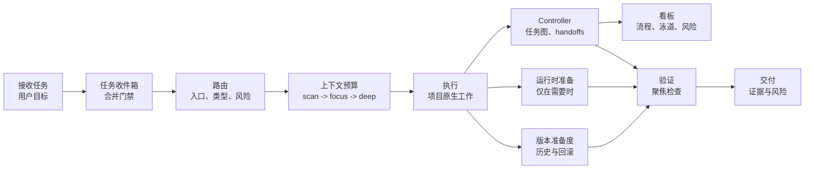

# omyKit

[](VERSION)
[](LICENSE)
[](skills)
[](docs/README.zh-CN.md)
[](https://github.com/GnosiST/omyKit/actions/workflows/validate.yml)

**omyKit 是一套轻量的 Codex 工作流套件，用于按上下文路由项目任务、降低上下文消耗、补齐验证门禁、准备运行时依赖，并让交付具备版本与回滚意识。**

它把一组项目级 Codex skills、prompt 别名、工作流文档和启停脚本组织成一个小而清晰的操作层。Codex 可以用它判断什么时候初始化项目规则、改造旧项目、执行具体需求、准备本地服务、检查版本管理状态，以及在交付前运行对应门禁。

omyKit 不希望接管每一步操作。任务被正确路由后，Codex 应该继续正常执行，只有在范围、风险、阶段或交付状态变化时才重新进入工作流。

语言：[English](README.md) | [简体中文](README.zh-CN.md)

## 为什么需要 omyKit

- **清晰路由：**按入口类型、项目类型、风险模式和交付物类型选择工作流。
- **入口决策闸门：**先展示所选路由，只有歧义会改变工作结果时才问 1-3 个允许自定义答案的问题。
- **低上下文浪费：**用 `scan -> focus -> deep` 逐级加载上下文。
- **压缩感知预算：**先缩小范围和摘要，只有大型可取回内容仍然重要时，才使用可选本地压缩。
- **模板驱动任务图：**长任务、可续跑任务和多节点工作可复用 workflow 模板，并使用本地 C-lite controller 和静态看板。
- **任务收件箱与合并门禁：**记录重复任务 brief，把同源工作合并进当前 workflow，把后续问题链接到历史 workflow，并把无关请求拆成新 workflow。
- **Scorecard 验票：**先检查真实 handoff、入口决策、交付进化复盘、验证证据、协作审计、语言一致性、skill 使用、用量记录、推荐模型和实际模型记录，再相信完成声明。
- **Skill 可追踪：**实际使用过 skill 时，看板能展示每个节点或 worker 用了什么。
- **模型可追踪：**按节点推荐合适档位和具体模型，并在运行环境暴露时展示实际使用模型。
- **自动编排：**主 Codex 对话保持 orchestrator-observer，由 controller 判断就绪工作应该在主线程、子智能体、后台线程还是 worktree 中执行，并在需要运行时真实创建 worker 时输出派发契约。
- **全局协作审查：**多智能体工作启动后，由独立 `global-auditor` 在集成前记录 `communication_audit`，把 worker 一致性、矛盾、范围漂移和证据缺口显式化。
- **交付证据：**用可复核的检查结果替代空泛的“已完成”。
- **运行时准备：**只有测试或应用检查需要中间件时才准备数据库、缓存、队列、对象存储等服务。
- **版本意识：**暴露分支、changelog、tag/release、回滚、历史追踪和定制化边界缺口。
- **语言感知输出：**可见计划、问题、推理摘要和 handoff 跟随用户提示词语言。
- **来源感知选择：**先标清每个注册表条目是核心项、本地已安装 skill、已跟踪上游参考、平台工具、OpenAI bundled 工具，还是仓库本地机制，再决定是否使用。
- **保守 skill 准入：**社区 PM、审美、目录和 meta-UX 类 skill 不进入默认路由，除非用户明确要求。
- **能力缺口接入：**现有工具不能满足任务时，先记录缺口，在本地或目标项目试验候选，再根据证据决定是否提升。
- **证据驱动进化：**delivery handoff 记录可复用 workflow 候选，scorecard 验证复盘是否发生，只有通过抽象测试的经验才提升进 omyKit。
- **上游参考监控：**定期检查被引用的外部来源是否变化，先审查可复用 workflow 经验，再决定是否吸收。

## 工作流一览



## 快速开始

### 在 Codex 中给项目启用

首次安装时还没有 `$omykit`，所以直接用普通对话告诉 Codex：

```text
帮我给当前项目启用 omyKit：https://github.com/GnosiST/omyKit
```

Codex 可以替你 clone 仓库、运行项目级启用脚本，并返回目标项目里的 `.omykit/kit/install-manifest`。启用脚本会复制真实文件，不使用 symlink，并把 `.omykit/` 和 omyKit 管理的 `.codex` 入口写入目标项目的 `.git/info/exclude`，默认不提交到远程。启用完成后，如果当前 Codex 线程没有刷新 skill 列表，打开新的 Codex 线程。

手动 fallback：

```bash
git clone https://github.com/GnosiST/omyKit.git
cd omyKit
./scripts/project-local.sh enable /path/to/your/project
```

随时开关：

```bash
./scripts/project-local.sh status /path/to/your/project
./scripts/project-local.sh disable /path/to/your/project
./scripts/project-local.sh enable /path/to/your/project
./scripts/project-local.sh uninstall /path/to/your/project
```

`disable` 只关闭项目里的 Codex skill/prompt 入口，保留 `.omykit` 运行历史，方便之后重新启用；`uninstall` 会把 `.omykit` 归档到本地非项目目录，适合彻底剥离。

### 在 Codex 中使用

打开新的 Codex 线程，然后在 Codex 对话里输入：

```text
$omykit help
$omykit 初始化项目
$omykit 改造旧项目
$omykit 开始一个需求
$omykit 开始执行：<长任务>
$omykit 只创建工作流：<任务>
$omykit 继续工作流
$omykit 解除阻塞
$omykit 生成看板并打开
$omykit 查看工作流状态
$omykit 升级旧工作流
$omykit 诊断工作流健康
$omykit 清理旧工作流残留
$omykit 交付检查
$omykit 查看本项目 omyKit 状态
$omykit 关闭本项目 omyKit
$omykit 启用本项目 omyKit
$omykit 更新本项目 omyKit
```

Codex 应该在内部运行需要的 controller 或安装命令，并把结果、路径和剩余风险返回给你。开头的 `$` 是 skill 触发写法的一部分，不是 shell 提示符。

如果只是想看命令和用法，直接输入 `$omykit help` 或 `$omykit 帮助`，不需要再翻文档。

如果你的 Codex 客户端支持 prompt 文件，这也是 Codex 对话输入，不是终端命令：

```text
/prompts:omykit 初始化项目
```

不要默认假设 `/omykit` 可用，除非本地 Codex 客户端明确把自定义 prompt 映射成这种命令形式。

对于已启用 controller 的追踪型 workflow，优先使用 Codex 对话：

```text
$omykit 开始执行：测试 MVP1 角色权限
$omykit 继续执行
$omykit 查看工作流列表
$omykit 下一步
$omykit 生成看板并打开
```

`开始执行` 表示 Codex 应该创建或续跑 workflow、运行自动编排计划、内部启动或派发就绪工作、写 handoff，并持续推进到 delivery 通过或遇到真实阻塞。只有想先拿骨架和手动续跑命令时，才用 `只创建工作流`。Codex 会在内部运行 controller，并返回生成路径。项目终端中的手动 fallback：

```bash
node scripts/omykit-workflow.mjs workflows
node scripts/omykit-workflow.mjs workflows use <workflow-id>
node scripts/omykit-workflow.mjs resume
node scripts/omykit-workflow.mjs orchestrate --json
node scripts/omykit-workflow.mjs upgrade --all
node scripts/omykit-workflow.mjs doctor --lang zh-CN
node scripts/omykit-workflow.mjs cleanup --dry-run --lang zh-CN
node scripts/omykit-workflow.mjs cleanup --git-removal-plan --lang zh-CN
node scripts/omykit-workflow.mjs cleanup --untrack-runtime --apply --lang zh-CN
node scripts/omykit-workflow.mjs cleanup --reset-runtime --apply --lang zh-CN
node scripts/omykit-workflow.mjs cleanup --uninstall-local --apply --lang zh-CN
node scripts/omykit-workflow.mjs board --open --lang zh-CN
```

项目级安装的默认 controller 位于：

```bash
node .omykit/kit/scripts/omykit-workflow.mjs status
node .omykit/kit/scripts/omykit-workflow.mjs board --open --lang zh-CN
```

controller 仍然保留 `tasks`、`dispatch-plan`、`context-pack`、`assign` 和 `record-run` 等低层原子命令，供 Codex 内部、CI 或排障使用；它们不是普通用户默认要选择的命令。任务类 Codex 请求会先进入任务收件箱，由合并门禁判断是合并进当前 workflow、链接为后续问题，还是创建新 workflow；当 `init` 用同一条 pending brief 创建新 workflow 时，会自动把匹配任务关联进去。`doctor` 会写入 `.omykit/health/health-report.json`，检查旧项目改造完整度、本地隔离、命名空间冲突、active workflow 指针、任务收件箱可解析性、旧 artifact 缺口、过期看板、后台命令续接信号、已被 Git 跟踪的 runtime 或旧 workflow 产物、清理候选和下一步建议。`doctor --fix` 只做安全兼容修复和本地 `.git/info/exclude` 忽略修复；不会伪造 handoff、用量、模型、skill 或验证证据，也默认不修改项目 `.gitignore`。`cleanup` 默认 dry-run；`cleanup --apply` 只把安全候选归档到 `.omykit/archive/`；`cleanup --untrack-runtime --apply` 会保留本地 `.omykit/` 但把它从 Git index 撤出；`cleanup --reset-runtime --apply` 会撤出 runtime 并归档本地 `.omykit/`；`cleanup --uninstall-local --apply` 会把整个 `.omykit/` runtime 移到本地非项目归档位置。这些 cleanup 命令都不会自动 commit、push 或重写 Git 历史；如果敏感 workflow 产物已经推送，需要人工确认后做 Git history cleanup。`board` 命令会写入 `.omykit/workflows/<workflow-id>/board.json` 和 `board.html`。新的追踪型 workflow 可以用 `--template auto` 在 `change.standard`、`bugfix.standard`、`frontend-ui.strict`、`deck.proposal` 和 `mission.orchestration` 中自动选择；显式指定模板会覆盖自动选择。看板语言默认跟随 workflow 语言，也可以用 `--lang zh-CN` 显式覆盖。handoff 和 assignment 提供记录时，看板还会展示 workflow metadata、任务收件箱、工作流组、冲突仲裁信号、每个节点和 worker 实际使用的 skill、执行方案与确认状态、推荐模型、实际模型记录、全局协作审计、delivery 知识同步审查、Agent 通讯录、交接包、压缩上下文包和后台命令续接记录。这是本地静态视图，不是实时服务。

## 仓库内容

| 路径 | 作用 |
| --- | --- |
| `skills/` | 项目级启用时复制到目标项目 `.codex/skills/` 的 Codex skills；全局安装仅作为显式 fallback。 |
| `prompts/` | 可选 prompt 别名，用于从支持 prompt 文件的客户端启动 omyKit。 |
| `docs/workflow/` | 设置、路由、controller、上下文预算、运行时准备、版本管理、工具注册表和交付门禁文档。 |
| `schemas/` | controller graph、节点卡、state、assignment 和 handoff 的 JSON schemas。 |
| `scripts/` | 校验、workflow controller、项目级启停、显式全局安装、按 git ref 安装、回滚等脚本。 |
| `workflow-templates/` | Controller 使用的分层 YAML workflow 模板、agent/model/runtime/safety profiles 和 scorecards。 |
| `upstream-sources.json` | 官方 workflow、spec、本地 skill、平台工具、设计、动效、生态和上下文压缩外部参考来源的 baseline 与来源完整性快照。 |
| `AGENTS.md` | 本仓库维护规则。 |

## Skill 层

| Skill | 作用 |
| --- | --- |
| `omykit` | 初始化、改造旧项目、需求执行、交付检查的统一入口。 |
| `codex-project-router` | 判断入口类型、项目类型、工作模式和工具路径。 |
| `codex-context-budget` | 控制上下文加载层级并处理压缩边界：`scan -> focus -> deep`，精确证据回到原文。 |
| `codex-project-init` | 为新项目创建最小 Codex 工作流层。 |
| `codex-project-retrofit` | 在不破坏现有结构的前提下为旧项目接入工作流。 |
| `codex-change-workflow` | 从 brief/spec 到执行和验证，处理具体功能、修复、重构或文档任务。 |
| `codex-runtime-readiness` | 在需要本地服务时准备数据库、缓存、对象存储、队列、浏览器或模拟器。 |
| `codex-version-readiness` | 检查目标项目的分支、发布、回滚、历史版本和定制化修改准备度。 |
| `codex-delivery-gate` | 在 handoff、导出、提交、PR 或发布前检查交付证据。 |
| `codex-workflow-evolution` | 只有反复出现且通过抽象测试的 workflow 经验，才提升进 omyKit。 |

查看 [Skill 协调机制](docs/workflow/skill-coordination.zh-CN.md)，了解每个集成 skill 负责什么、何时交接，以及为什么它们不会互相打架。

## Controller 层

长任务或 Strict 工作可以把任务图持久化到 `.omykit/workflows/<workflow-id>/`，并用 `scripts/omykit-workflow.mjs` 记录任务 brief、运行合并门禁、校验 handoff、查看 ready 节点、记录 blockers、生成节点上下文包、记录长后台命令的续接元数据、生成静态协作看板，并支持 compact 后续跑。

Controller 是本地确定性机制。它不调用模型，不自动启动 agent，不自动改代码，不替代 Codex，也不会让 Lite 任务默认变重。项目级启用会把 controller 复制到目标项目 `.omykit/kit/scripts/omykit-workflow.mjs`，schemas 位于 `.omykit/kit/schemas/`，workflow 模板位于 `.omykit/kit/workflow-templates/`。全局安装路径只作为用户明确要求或客户端不支持项目级 skill 时的 fallback。

Controller 是模板驱动的。内置 YAML 模板把图拓扑、agent 角色、模型配置、运行配置、安全限位和 scorecard 分层定义；因此同类任务可以复用稳定流程，不同 issue 只改变输入、证据和产物。`init --template auto` 会在 `change.standard`、`bugfix.standard`、`frontend-ui.strict`、`deck.proposal` 和 `mission.orchestration` 中自动选择；用户显式指定模板时仍优先尊重用户选择。可以用 `templates list`、`templates show <id>` 和 `templates validate` 查看或校验已安装模板。

`board` 命令会生成面向工具的 `board.json` 和面向浏览器查看的 `board.html`。它展示所选模板、Scorecard 结果、任务收件箱、合并门禁决策、工作流组、冲突仲裁信号、入口决策、workflow 进化候选、全局协作审计、delivery 知识同步审查、可点击任务追踪表、每个节点实际完成的工作项、变更文件摘要、已记录的 skill 使用、验证结果、证据是否存在、下游交接上下文、生成的交接包、后台命令续接记录、子智能体活动、Agent 通讯录分工、运行时策略阻塞、推荐模型档位、推荐具体模型、实际模型记录、用量观测状态、token 与上下文覆盖率、任务合同大小、上下文来源分布、节点耗时、ETA 估算、项目快照、依赖/打回流、worker 分道、blocker、decision、重试、事件和自动生成的整改建议，不引入服务端或数据库。Provider token 只聚合有记录的执行证据；运行环境不可观测的指标会和缺失记录分开显示，不会猜测或当成 0。上下文总量会合并已记录的 handoff/agent context，以及 controller 从生成的 context-pack 或节点合同中确定性测量出的估算值，并标明来源。

## 工作流模型

```text
intake -> task inbox/merge gate -> route -> context budget -> spec/brief -> runtime readiness -> execute -> verify -> deliver -> learn
```

执行规则：

- 只在任务入口、范围/风险变化或交付前路由一次。
- 任务类 brief 先进入任务收件箱；派发 worker 前先合并同源工作、链接后续问题，并把无关请求拆成新 workflow。
- 入口阶段先说明目标、路由、执行形态或 controller 模板，以及影响交付的关键假设，再开始实现。
- 开始实现或派发 worker 前，先给出执行方案、推荐方案、取舍，并记录用户确认或明确自动授权。
- 在任务边界和关键阶段变化时使用工作流，不要每个文件读取、编辑或命令都重跑。
- 只有追踪型多节点、可续跑、容易 compact、被打回、需要并行或 Strict 工作才启用 controller。
- runtime state 和 omyKit 管理的项目级 `.codex` 入口默认只留本地：使用唯一 `.omykit/` 命名空间、本地 `.git/info/exclude`、doctor 隔离检查；需要临时关闭时用 `scripts/project-local.sh disable <project>`，需要恢复时用 `scripts/project-local.sh enable <project>`；已被 Git 跟踪但仍需本地保留时用 `cleanup --untrack-runtime --apply`，需要重置或剥离项目本地运行态时用 `cleanup --reset-runtime --apply`、`cleanup --uninstall-local --apply` 或 `scripts/project-local.sh uninstall <project>`。
- 创建追踪型 workflow 不等于任务完成；长任务要继续按 `resume/orchestrate -> 内部启动或派发 -> work -> handoff -> complete/reject/block/unblock` 循环推进，直到 delivery 通过或记录真实阻塞。
- 多智能体工作由自动编排计划根据任务适配度选择主线程、子智能体、后台线程或 worktree；主对话保持当前模型作为 orchestrator-observer；当计划返回 `dispatch_worker` 时创建真实 worker，并且只在当前运行时工具和策略允许时传入节点推荐模型 override。
- 多智能体工作产生多个 worker/assignment 记录时，集成前需要独立全局协作审计；审计必须记录已审查智能体、已审查 handoff、证据独立性、矛盾、范围漂移、发现项，以及是否存在无证据一致。
- 历史 `.omykit/workflows/*` 产物需要适配最新版 controller 时，使用 `upgrade --all` 补齐 controller 元数据、命令边界、节点卡和新版看板投影；升级时不得伪造缺失的 handoff、token、skill、模型或验证证据。
- 追踪型工作先选择最接近的 workflow 模板；需要定制时优先增改模板/profile YAML，不把一次性逻辑硬编码进 controller。
- PPT、presentation、slide、pitch deck 或提案 deck 工作使用 `deck.proposal`；controller 会把任务分为 `create`（从零生成 PPT）、`remake`（重制已有 PPT）或 `modify`（按原模板局部修改 PPT）三类 variant。入口应提供方向选项、记录已选生产面和模板策略，并让同类 PPT skill fallback 可审计，而不是把所有 PPT skill 叠加。
- 复杂需求需要需求洞察、任务拆解、多个工作流/工作分支路由、执行监听、集成验票和交付学习时，使用 `mission.orchestration`。
- 每个节点选择最低足够模型档位；由模型配置给出推荐模型，实际 provider/model 只有在执行环境暴露时才记录。
- Codex 新线程和子智能体运行面可能支持模型 override；只有当前运行时工具和策略允许时，才在创建 worker 时按节点推荐模型传入。若某个客户端或工具策略无法覆盖模型，记录 `usage_observation` 中的推荐/实际差异和不可观测原因。
- 执行环境没有暴露精确 token 或实际 worker 模型时，记录 `usage_observation` 的 `unavailable` 原因，不要伪造指标。
- 把上下文压缩视为有损过程：worker 接收有边界的 context-pack，而不是完整聊天历史；context-pack 内嵌序列化大小测量和 `context_loss_guard`，会喂给后续节点或恢复流程的 handoff 必须携带 `downstream_context` 以及可取回的来源/证据路径。
- 使用看板里的任务/上下文大小提醒拆分过大的节点、缩短依赖 handoff 摘要，或把大块证据正文改为可取回路径后再派发 worker。
- 把漂移当作 workflow 事件处理：非阻塞漂移进入 handoff notes 和 downstream risks；验收、安全、目标项目、破坏性操作或模板漂移必须带证据 block 或 reject 受影响节点。
- 当同类 specialist skill 都可能适用时，记录 `skill_decisions`：为什么选它、未选候选、用户不满意时换哪个 skill 重做，以及实际反馈结果。
- 追踪型交付必须记录 `evolution_candidates`；已复盘但没有可复用 workflow 经验时使用空数组。
- 同时记录 delivery `knowledge_sync`：README/docs/AGENTS 或记忆已同步时用 `completed`，没有持久知识变化时用 `not_needed`，确实延期时用带原因的 `deferred`。
- 默认从 `scan` 开始，进入实现时切到 `focus`，只有风险或阻塞需要时才进入 `deep`。
- 遇到大型输出时，先避免读取和缩小范围，再摘要；只有来源可信、可取回原文且仍有价值时才使用可选压缩。
- 优先使用项目原生命令和现有仓库约定，再考虑新增工具。
- 平台特定项目要根据项目证据和当前官方文档发现官方 CLI 或自动化 API，并在有用时写入项目本地指导。
- 优先使用官方、一方、专用或项目原生工具；Computer Use 只作为没有更好支持路径时的本地 GUI 最后 fallback。
- 当前 skill/工具集无法满足某个交付质量时，先记录 `capability_gaps`，再考虑采用新工具。优先走 `local_only` 或 `project_local` 试验；通用 kit 变更走 `omykit_candidate_branch`；没有来源、license、安装/运行、真实输出和回滚证据，不要把新的外部 skill 直接提交进主线。`hugohe3/ppt-master`、`op7418/guizang-ppt-skill`、`zarazhangrui/beautiful-html-templates` 和 `irenerachel/visual-style-ppt-skill` 是不同信任和 license 边界的 PPT/deck 参考，不是 vendored 依赖。
- 对持久项目检查版本准备度：分支状态、历史追踪、回滚路径、release notes 和定制化边界。
- 生成的项目规则属于目标项目，不应变成全局默认。
- 只有无法安全假设且答案会改变交付物、目标项目、风险、运行时、workflow 模板或 controller 选择时，才问 1-3 个问题；询问时允许用户自定义答案，不要只给固定选项。

## 文档

- [中文文档索引](docs/README.zh-CN.md)
- [Documentation index](docs/README.md)
- [安装与使用](docs/workflow/setup.zh-CN.md)
- [工作流总览](docs/workflow/codex-workflow-kit.zh-CN.md)
- [Skill 协调机制](docs/workflow/skill-coordination.zh-CN.md)
- [Workflow controller](docs/workflow/controller.zh-CN.md)
- [Workflow 模板](docs/workflow/workflow-templates.zh-CN.md)
- [Task graph](docs/workflow/task-graph.zh-CN.md)
- [Handoff protocol](docs/workflow/handoff-protocol.zh-CN.md)
- [多 Agent 协作](docs/workflow/multi-agent-coordination.zh-CN.md)
- [语言策略](docs/workflow/language-policy.zh-CN.md)
- [版本与回滚准备度](docs/workflow/versioning.zh-CN.md)
- [工具注册表](docs/workflow/tool-registry.zh-CN.md)
- [上游参考监控](docs/workflow/upstream-watch.zh-CN.md)
- [Workflow 进化](docs/workflow/evolution.zh-CN.md)
- [交付门禁](docs/workflow/delivery-gates.zh-CN.md)

## 校验

```bash
./scripts/validate-skills.sh
```

校验脚本使用 Codex 的 `skill-creator` validator，并额外强制检查 omyKit 必需的 `Language` 段，确保用户语言匹配和私有思维链边界不被删掉。如果当前 Python 没有 `PyYAML`，脚本会输出一次性虚拟环境命令。也可以显式指定 Python：

```bash
PYTHON=/path/to/venv/bin/python ./scripts/validate-skills.sh
PYTHON=/path/to/venv/bin/python node scripts/test-omykit-workflow.mjs
```

交付前推荐运行：

```bash
PYTHON=/path/to/venv/bin/python ./scripts/validate-skills.sh
node scripts/omykit-workflow.mjs templates validate
PYTHON=/path/to/venv/bin/python node scripts/test-omykit-workflow.mjs
node ./scripts/validate-docs.mjs
node ./scripts/check-upstream-refs.mjs
git diff --check
```

`test-omykit-workflow.mjs` 会覆盖 project-local 安装路径；当本地 `python3` 没有 `PyYAML` 时，它也需要继承同一个 `PYTHON`。

## 版本与回滚

omyKit 为目标项目提供 `codex-version-readiness`。当你初始化/改造仓库、准备发布、处理迁移、升级依赖，或执行任何需要回滚和历史追踪的变更时使用它。

它会检查目标项目是否有合适的版本来源、changelog 或 release notes、git 分支状态、tags/releases、回滚计划和定制化路径。它会暴露缺口，但不会强行给临时项目加沉重发布流程。

针对 omyKit 仓库本身：

```bash
./scripts/project-local.sh enable <target-project>
./scripts/project-local.sh status <target-project>
./scripts/project-local.sh disable <target-project>
./scripts/install-global.sh
./scripts/install-ref.sh main
./scripts/install-ref.sh <release-tag-or-commit-sha>
./scripts/rollback-global.sh latest
```

## 维护

修改 skill 文件后：

1. 运行 `./scripts/validate-skills.sh`。
2. controller 脚本或 schemas 变化时，运行 `node scripts/test-omykit-workflow.mjs`。
3. 运行 `node ./scripts/validate-docs.mjs`。
4. release 前，或外部参考可能影响 workflow 规则时，运行 `node ./scripts/check-upstream-refs.mjs`。
5. 运行 `./scripts/project-local.sh enable <target-project>` 验证项目级安装；安装结果必须是真实文件/目录，不应是 symlink。只有用户明确要求全局时才运行 `./scripts/install-global.sh`。
6. 检查 `<target-project>/.omykit/kit/install-manifest`；release/handoff 安装应指向最终提交，且 `git_dirty=false`。全局 fallback 则检查 `${CODEX_HOME:-$HOME/.codex}/omykit/install-manifest`。
7. 检查 `git diff --check`。
8. 本地与项目级安装验证通过后再提交和推送。

## 版权与第三方引用

本仓库应包含 omyKit 原创的工作流说明、脚本和文档，不有意打包第三方专有资产、私有文档或复制的产品手册。

Codex、GitHub、Docker、Canva、Remotion 等名称仅用于描述集成或工作流上下文，可能是各自所有者的商标。除非明确说明，本项目不代表这些所有者背书、赞助或关联。

新增内容时，示例、文案和模板应保持原创，或确认具备可复用许可。不要在未确认许可和署名要求的情况下复制第三方文档、品牌资产、截图、图标或专有工作流文本。外部项目默认只保留链接、来源完整性快照和范围明确的参考说明；只有 license 和署名要求允许时才考虑 vendoring。

## License

MIT. See [LICENSE](LICENSE).
