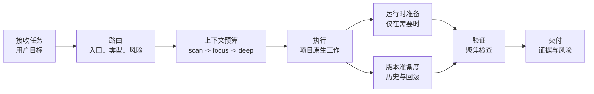

# omyKit

[](VERSION)
[](LICENSE)
[](skills)
[](docs/README.zh-CN.md)
[](https://github.com/GnosiST/omyKit/actions/workflows/validate.yml)

**omyKit 是一套轻量的 Codex 工作流套件，用于按上下文路由项目任务、降低上下文消耗、补齐验证门禁、准备运行时依赖，并让交付具备版本与回滚意识。**

它把一组全局 Codex skills、prompt 别名、工作流文档和安装/回滚脚本组织成一个小而清晰的操作层。Codex 可以用它判断什么时候初始化项目规则、改造旧项目、执行具体需求、准备本地服务、检查版本管理状态，以及在交付前运行对应门禁。

omyKit 不希望接管每一步操作。任务被正确路由后，Codex 应该继续正常执行，只有在范围、风险、阶段或交付状态变化时才重新进入工作流。

语言：[English](README.md) | [简体中文](README.zh-CN.md)

## 为什么需要 omyKit

- **清晰路由：**按入口类型、项目类型、风险模式和交付物类型选择工作流。
- **低上下文浪费：**用 `scan -> focus -> deep` 逐级加载上下文。
- **交付证据：**用可复核的检查结果替代空泛的“已完成”。
- **运行时准备：**只有测试或应用检查需要中间件时才准备数据库、缓存、队列、对象存储等服务。
- **版本意识：**暴露分支、changelog、tag/release、回滚、历史追踪和定制化边界缺口。
- **语言感知输出：**可见计划、问题、推理摘要和 handoff 跟随用户提示词语言。
- **参考感知选择：**只有 PM、设计和生态资源发现信号能改善当前 workflow 时才按需使用，不复制第三方内容。

## 工作流一览



## 快速开始

从 GitHub 安装：

```bash
git clone https://github.com/GnosiST/omyKit.git
cd omyKit
./scripts/install-global.sh
```

打开新的 Codex 线程让 skill 列表刷新，然后在 Codex 对话里输入：

```text
$omykit 初始化项目
$omykit 改造旧项目
$omykit 开始一个需求
$omykit 交付检查
```

开头的 `$` 是 skill 触发写法的一部分，不是 shell 提示符。

如果你的 Codex 客户端支持 prompt 文件，这也是 Codex 对话输入，不是终端命令：

```text
/prompts:omykit 初始化项目
```

不要默认假设 `/omykit` 可用，除非本地 Codex 客户端明确把自定义 prompt 映射成这种命令形式。

## 仓库内容

| 路径 | 作用 |
| --- | --- |
| `skills/` | 安装到 `${CODEX_HOME:-$HOME/.codex}/skills/` 的 Codex skills。 |
| `prompts/` | 可选 prompt 别名，用于从支持 prompt 文件的客户端启动 omyKit。 |
| `docs/workflow/` | 设置、路由、上下文预算、运行时准备、版本管理、工具注册表和交付门禁文档。 |
| `scripts/` | 校验、全局安装、按 git ref 安装、回滚等脚本。 |
| `AGENTS.md` | 本仓库维护规则。 |

## Skill 层

| Skill | 作用 |
| --- | --- |
| `omykit` | 初始化、改造旧项目、需求执行、交付检查的统一入口。 |
| `codex-project-router` | 判断入口类型、项目类型、工作模式和工具路径。 |
| `codex-context-budget` | 控制上下文加载层级：`scan -> focus -> deep`。 |
| `codex-project-init` | 为新项目创建最小 Codex 工作流层。 |
| `codex-project-retrofit` | 在不破坏现有结构的前提下为旧项目接入工作流。 |
| `codex-change-workflow` | 从 brief/spec 到执行和验证，处理具体功能、修复、重构或文档任务。 |
| `codex-runtime-readiness` | 在需要本地服务时准备数据库、缓存、对象存储、队列、浏览器或模拟器。 |
| `codex-version-readiness` | 检查目标项目的分支、发布、回滚、历史版本和定制化修改准备度。 |
| `codex-delivery-gate` | 在 handoff、导出、提交、PR 或发布前检查交付证据。 |

查看 [Skill 协调机制](docs/workflow/skill-coordination.zh-CN.md)，了解每个集成 skill 负责什么、何时交接，以及为什么它们不会互相打架。

## 工作流模型

```text
intake -> route -> context budget -> spec/brief -> runtime readiness -> execute -> verify -> deliver -> learn
```

执行规则：

- 只在任务入口、范围/风险变化或交付前路由一次。
- 在任务边界和关键阶段变化时使用工作流，不要每个文件读取、编辑或命令都重跑。
- 默认从 `scan` 开始，进入实现时切到 `focus`，只有风险或阻塞需要时才进入 `deep`。
- 优先使用项目原生命令和现有仓库约定，再考虑新增工具。
- 对持久项目检查版本准备度：分支状态、历史追踪、回滚路径、release notes 和定制化边界。
- 生成的项目规则属于目标项目，不应变成全局默认。
- 只有无法安全假设时才询问用户；询问时允许用户自定义答案，不要只给固定选项。

## 文档

- [中文文档索引](docs/README.zh-CN.md)
- [Documentation index](docs/README.md)
- [安装与使用](docs/workflow/setup.zh-CN.md)
- [工作流总览](docs/workflow/codex-workflow-kit.zh-CN.md)
- [Skill 协调机制](docs/workflow/skill-coordination.zh-CN.md)
- [语言策略](docs/workflow/language-policy.zh-CN.md)
- [版本与回滚准备度](docs/workflow/versioning.zh-CN.md)
- [工具注册表](docs/workflow/tool-registry.zh-CN.md)
- [交付门禁](docs/workflow/delivery-gates.zh-CN.md)

## 校验

```bash
./scripts/validate-skills.sh
```

校验脚本使用 Codex 的 `skill-creator` validator。如果当前 Python 没有 `PyYAML`，脚本会输出一次性虚拟环境命令。也可以显式指定 Python：

```bash
PYTHON=/path/to/venv/bin/python ./scripts/validate-skills.sh
```

交付前推荐运行：

```bash
./scripts/validate-skills.sh
node ./scripts/validate-docs.mjs
git diff --check
```

## 版本与回滚

omyKit 为目标项目提供 `codex-version-readiness`。当你初始化/改造仓库、准备发布、处理迁移、升级依赖，或执行任何需要回滚和历史追踪的变更时使用它。

它会检查目标项目是否有合适的版本来源、changelog 或 release notes、git 分支状态、tags/releases、回滚计划和定制化路径。它会暴露缺口，但不会强行给临时项目加沉重发布流程。

针对 omyKit 仓库本身：

```bash
./scripts/install-global.sh
./scripts/install-ref.sh v0.1.0
./scripts/rollback-global.sh latest
```

## 维护

修改 skill 文件后：

1. 运行 `./scripts/validate-skills.sh`。
2. 运行 `node ./scripts/validate-docs.mjs`。
3. 运行 `./scripts/install-global.sh` 更新全局 Codex skill 副本。
4. 检查 `${CODEX_HOME:-$HOME/.codex}/omykit/install-manifest`。
5. 检查 `git diff --check`。
6. 本地与全局副本验证通过后再提交和推送。

## 版权与第三方引用

本仓库应包含 omyKit 原创的工作流说明、脚本和文档，不有意打包第三方专有资产、私有文档或复制的产品手册。

Codex、GitHub、Docker、Canva、Remotion 等名称仅用于描述集成或工作流上下文，可能是各自所有者的商标。除非明确说明，本项目不代表这些所有者背书、赞助或关联。

新增内容时，示例、文案和模板应保持原创，或确认具备可复用许可。不要在未确认许可和署名要求的情况下复制第三方文档、品牌资产、截图、图标或专有工作流文本。

## License

MIT. See [LICENSE](LICENSE).
