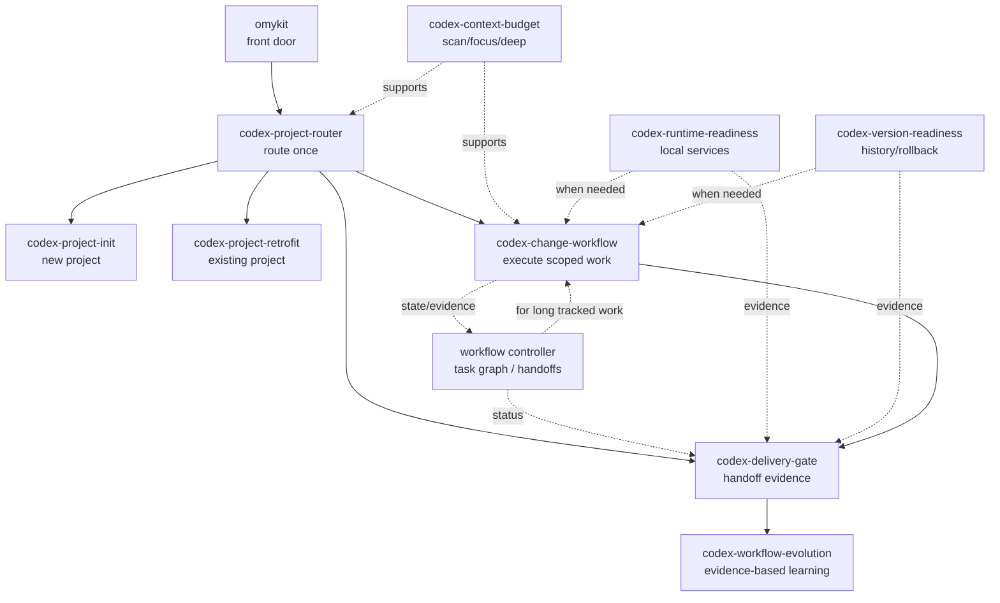

# Skill Coordination

Language: [English](skill-coordination.md) | [简体中文](skill-coordination.zh-CN.md)

omyKit skills are designed as a coordinated workflow layer, not as competing agents. Each skill owns one phase or concern, then hands control back to the main task.

## Coordination Rules

1. `omykit` is the front door. It routes the task once at intake, scope change, risk change, or delivery.
2. The selected route stays stable until new evidence changes the task type, risk, artifact, or user intent.
3. Each specialist skill owns a narrow concern: context, setup, execution, runtime, versioning, delivery, or workflow evolution.
4. Cross-cutting checks are additive. Runtime, versioning, and delivery skills support the active workflow; they do not replace it.
5. Use the smallest applicable mode. Do not run every skill for every task.

## Coordination Diagram

## Integrated Skill Map

| Skill | Owns | Use when | Hands off to | Why it does not conflict |
| --- | --- | --- | --- | --- |
| `omykit` | Front-door intake and initial route. | The user asks to initialize, retrofit, start work, or run delivery checks. | `codex-project-init`, `codex-project-retrofit`, `codex-change-workflow`, or `codex-delivery-gate`. | It routes and exits; it does not own implementation. |
| `codex-project-router` | Project type, entry type, mode, and tool path. | The task needs classification before loading heavier context. | The workflow skill selected by task type. | It makes one routing decision and keeps that route until scope or risk changes. |
| `codex-context-budget` | Context loading level: `scan`, `focus`, or `deep`. | Any workflow needs to decide how much repository, tool, or artifact context to load. | The active workflow. | It controls context volume only; it does not decide product behavior or delivery outcome. |
| `codex-project-init` | New-project workflow layer. | A repository or artifact workspace lacks durable Codex rules and workflow docs. | Router, change workflow, runtime readiness, or delivery gate as needed. | It applies to new projects; existing projects use retrofit instead. |
| `codex-project-retrofit` | Existing-project workflow layer. | A maintained repository needs omyKit without disrupting current conventions. | Router, change workflow, runtime readiness, or delivery gate as needed. | It preserves existing structure; it does not reinitialize a project from scratch. |
| `codex-change-workflow` | Scoped execution from brief/spec through focused verification. | A concrete feature, fix, refactor, design pass, deck/video edit, research task, or data task starts. | Runtime readiness, version readiness, and delivery gate when relevant. | It owns the execution phase and delegates only narrow checks. |
| `workflow controller` | Repo-local task graph, node state, handoff validation, retry visibility, and continuation state. | Standard work is multi-node, compact-prone, parallel, rejected, resumable, or explicitly tracked; Strict work uses it by default. | The active change workflow and delivery gate. | It stores state and validates handoffs; it does not route, call models, or replace implementation skills. |
| `codex-runtime-readiness` | Local middleware and verification dependencies. | Tests, dev servers, migrations, browser checks, or smoke tests need services such as databases, caches, queues, object storage, browsers, or emulators. | The active change or delivery workflow. | It prepares dependencies; it does not change app behavior or release policy. |
| `codex-version-readiness` | Branch, release, rollback, history, and customization readiness. | Work is durable, risky, release-bound, migration-related, dependency-related, or needs rollback/history lookup. | The active change or delivery workflow. | It reports readiness and gaps; it does not force heavyweight release machinery onto every task. |
| `codex-delivery-gate` | Final evidence before handoff, export, commit, PR, or release. | The agent is about to claim work is complete or ready. | Final response, commit, PR, export, or release action. | It runs at handoff boundaries; it does not interrupt every intermediate command. |
| `codex-workflow-evolution` | Evidence-based improvement of omyKit skills, docs, validators, and registry rules. | Repeated feedback, missed routing, stale workflow docs, tool-selection ambiguity, validation gaps, or retrospectives show the generic kit should change. | The smallest owner surface: docs, skill, reference, script, or no durable change. | It separates generic omyKit lessons from target-project facts and does not run for every task. |

## Common Combinations

| Scenario | Primary workflow | Supporting skills |
| --- | --- | --- |
| New app project | `codex-project-init` | `codex-context-budget`, `codex-runtime-readiness`, `codex-version-readiness`, `codex-delivery-gate` as needed. |
| Existing repo upgrade | `codex-project-retrofit` | `codex-context-budget`, `codex-version-readiness`, `codex-delivery-gate`. |
| Feature or bug fix | `codex-change-workflow` | `codex-context-budget`, `codex-runtime-readiness` for middleware, `codex-version-readiness` for rollback, `codex-delivery-gate` before handoff. |
| Long tracked task | `codex-change-workflow` | Workflow controller for task graph, handoffs, rejects, blockers, and compact recovery. |
| Documentation or research artifact | `codex-change-workflow` | `codex-context-budget`, `codex-delivery-gate`; version readiness only when the work is durable or release-bound. |
| Release preparation | `codex-delivery-gate` | `codex-version-readiness`, runtime checks, artifact-specific gates. |
| Repeated workflow friction | `codex-workflow-evolution` | `codex-context-budget`, relevant owner skill, validation scripts. |

## Conflict Prevention

- **Init vs retrofit:** choose by project state. New project uses init; existing project uses retrofit.
- **Router vs change workflow:** router classifies; change workflow executes.
- **Runtime vs versioning:** runtime prepares services; versioning checks rollback and history.
- **Change workflow vs controller:** change workflow decides and executes; controller persists task graph state and validates structured handoffs.
- **Change workflow vs delivery gate:** change workflow builds the deliverable; delivery gate verifies evidence before completion.
- **Delivery gate vs workflow evolution:** delivery gate captures evidence; workflow evolution decides whether that evidence becomes a generic omyKit change.
- **Context budget vs every other skill:** context budget limits reading and tool output; it never overrides the specialist workflow.

If a task appears to need many skills, start with the primary workflow and add only the supporting checks that change the next decision.
