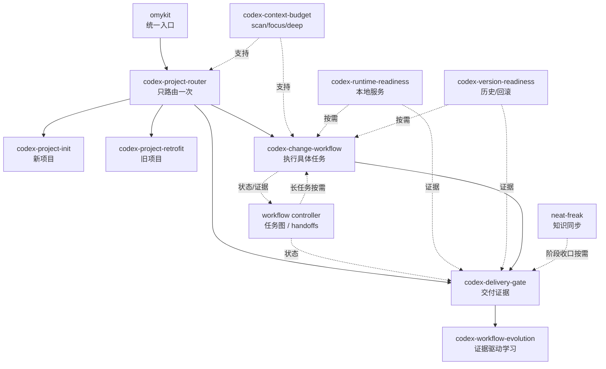

# Skill 协调机制

语言：[English](skill-coordination.md) | [简体中文](skill-coordination.zh-CN.md)

omyKit 的 skills 是一个协作式工作流层，不是一组互相竞争的 agent。每个 skill 只负责一个阶段或一个横切关注点，完成后把控制权交回当前任务。

## 协调规则

1. `omykit` 是统一入口，只在任务入口、范围变化、风险变化或交付前做路由。
2. 路由一旦确定，就保持稳定，直到任务类型、风险、交付物或用户意图发生变化。
3. 每个 specialist skill 只负责一个窄边界：上下文、项目接入、执行、运行时、版本管理、交付或 workflow 进化。
4. 横切检查是补充关系。运行时、版本管理和交付门禁支持当前 workflow，不替代它。
5. 使用最小适用模式。不要每个任务都运行所有 skill。

## 协调图

## 集成 Skill 功能表

| Skill | 负责什么 | 何时使用 | 交给谁 | 为什么不会打架 |
| --- | --- | --- | --- | --- |
| `omykit` | 统一入口和首次路由。 | 用户要求初始化、改造旧项目、开始需求或做交付检查。 | `codex-project-init`、`codex-project-retrofit`、`codex-change-workflow` 或 `codex-delivery-gate`。 | 它只路由，不接管实现。 |
| `codex-project-router` | 判断项目类型、入口类型、模式和工具路径。 | 需要先分类再加载更重上下文。 | 任务类型对应的 workflow skill。 | 它只做一次路由决策，直到范围或风险变化才重新路由。 |
| `codex-context-budget` | 控制上下文层级：`scan`、`focus`、`deep`。 | 任何 workflow 需要决定读取多少仓库、工具或交付物上下文。 | 当前激活的 workflow。 | 它只控制上下文量，不决定产品行为或交付结果。 |
| `codex-project-init` | 新项目的 Codex 工作流层。 | 仓库或交付物工作区还没有稳定的 Codex 规则和 workflow docs。 | 根据需要交给 router、change workflow、runtime readiness 或 delivery gate。 | 它只用于新项目；旧项目用 retrofit。 |
| `codex-project-retrofit` | 旧项目的 Codex 工作流层接入。 | 维护中的仓库需要接入 omyKit，同时保留现有约定。 | 根据需要交给 router、change workflow、runtime readiness 或 delivery gate。 | 它保留现有结构，不把旧项目重新初始化。 |
| `codex-change-workflow` | 从 brief/spec 到执行和聚焦验证。 | 开始具体功能、修复、重构、设计、deck/video、research 或 data 任务。 | 需要时调用 runtime readiness、version readiness 和 delivery gate。 | 它负责执行阶段，只把窄范围检查委托出去。 |
| `workflow controller` | 仓库本地任务图、节点状态、handoff 校验、重试可见性和续跑状态。 | Standard 工作是多节点、容易 compact、需要并行、被打回、需要续跑或明确要求追踪时；Strict 工作默认使用。 | 当前 change workflow 和 delivery gate。 | 它只保存状态和校验 handoff，不路由、不调用模型、不替代实现 skill。 |
| `codex-runtime-readiness` | 本地中间件和验证依赖。 | 测试、dev server、迁移、浏览器检查或 smoke test 需要数据库、缓存、队列、对象存储、浏览器或模拟器。 | 当前 change 或 delivery workflow。 | 它只准备依赖，不改变应用行为或发布策略。 |
| `codex-version-readiness` | 分支、发布、回滚、历史追踪和定制化准备度。 | 工作是持久的、高风险的、发布相关的、迁移相关的、依赖相关的，或需要回滚/历史查询。 | 当前 change 或 delivery workflow。 | 它只报告准备度和缺口，不强行给每个任务加重型发布流程。 |
| `codex-delivery-gate` | handoff、导出、提交、PR 或发布前的最终证据。 | agent 准备声明完成或 ready。 | 最终回复、提交、PR、导出或发布动作。 | 它只在交付边界运行，不打断每个中间命令。 |
| `neat-freak` | docs、AGENTS/CLAUDE 规则和 agent 记忆的知识同步。 | 阶段收口、文档/记忆过期，或追踪型交付 `knowledge_sync` 需要审查。 | `codex-delivery-gate` 证据或最终 handoff。 | 它只处理知识面，不路由、不实现、不每个节点都运行。 |
| `codex-workflow-evolution` | 基于证据改进 omyKit skills、docs、validators 和 registry rules。 | 反复反馈、路由遗漏、workflow docs 过期、工具选择歧义、验证缺口或复盘表明通用 kit 需要变化。 | 最小 owner surface：docs、skill、reference、script，或不做持久变更。 | 它区分通用 omyKit 经验和目标项目事实，不会每个任务都运行。 |

## 常见组合

| 场景 | 主 workflow | 支持 skills |
| --- | --- | --- |
| 新 app 项目 | `codex-project-init` | 按需使用 `codex-context-budget`、`codex-runtime-readiness`、`codex-version-readiness`、`codex-delivery-gate`。 |
| 旧仓库升级 | `codex-project-retrofit` | `codex-context-budget`、`codex-version-readiness`、`codex-delivery-gate`。 |
| 功能或 bug 修复 | `codex-change-workflow` | 中间件需要时用 `codex-runtime-readiness`；需要回滚时用 `codex-version-readiness`；交付前用 `codex-delivery-gate`。 |
| 长任务追踪 | `codex-change-workflow` | 使用 workflow controller 管理任务图、handoff、打回、阻塞和 compact 后恢复。 |
| 文档或研究交付物 | `codex-change-workflow` | `codex-context-budget`、`codex-delivery-gate`；只有持久或发布相关时才用 version readiness。 |
| 提案或演示文稿 PPT | 使用 `deck.proposal` 的 `codex-change-workflow` | `codex-context-budget`，优先 bundled `presentations`/Canva/项目模板；可选 deck specialist 通过 `skill_decisions` 和 `capability_gaps` 记录，再进入 `codex-delivery-gate`。 |
| 发布准备 | `codex-delivery-gate` | `codex-version-readiness`、运行时检查、交付物类型门禁。 |
| 阶段知识收口 | `codex-delivery-gate` | 只有 docs、AGENTS/CLAUDE 规则或记忆可能过期时才用 `neat-freak`；否则记录 `knowledge_sync.status=not_needed`。 |
| 用户不满意 specialist 产物 | 当前主 workflow | 查看节点 `skill_decisions[].fallback_policy`，只把不满意的质量维度交给更合适的同类或窄能力 skill 重做。 |
| 反复出现的 workflow 摩擦 | `codex-workflow-evolution` | `codex-context-budget`、相关 owner skill、validation scripts。 |

## 防冲突原则

- **init vs retrofit：**按项目状态选择。新项目用 init，旧项目用 retrofit。
- **router vs change workflow：**router 分类，change workflow 执行。
- **runtime vs versioning：**runtime 准备服务，versioning 检查回滚和历史。
- **change workflow vs controller：**change workflow 决策和执行，controller 保存任务图状态并校验结构化 handoff。
- **change workflow vs delivery gate：**change workflow 产出交付物，delivery gate 在完成前验证证据。
- **delivery gate vs neat-freak：**delivery gate 判断交付证据；neat-freak 只在需要时同步知识面，并记录 `knowledge_sync`。
- **delivery gate vs workflow evolution：**delivery gate 捕获证据，workflow evolution 判断证据是否应进入通用 omyKit。
- **skills_used vs skill_decisions：**`skills_used` 记录实际调用，`skill_decisions` 记录为什么这样选、没选谁和用户不满意时如何换；它不替代路由器，也不要求没有同类竞争的节点伪造记录。
- **context budget vs 其他 skill：**context budget 限制读取和工具输出，不覆盖 specialist workflow。

如果一个任务看起来需要很多 skills，先确定主 workflow，再只加入会影响下一步决策的支持检查。
